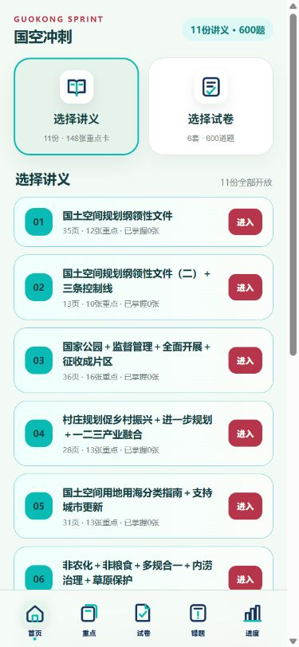
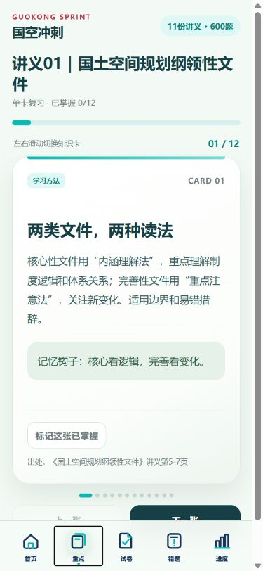
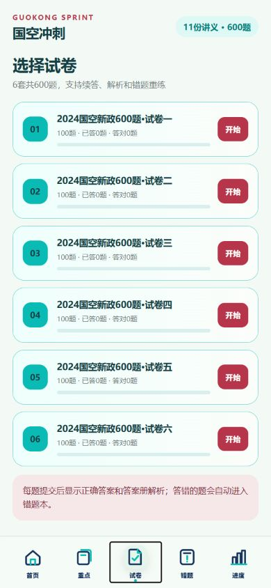
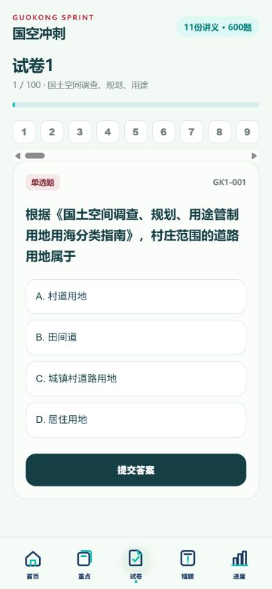
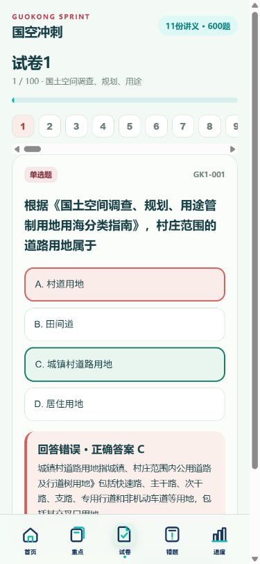
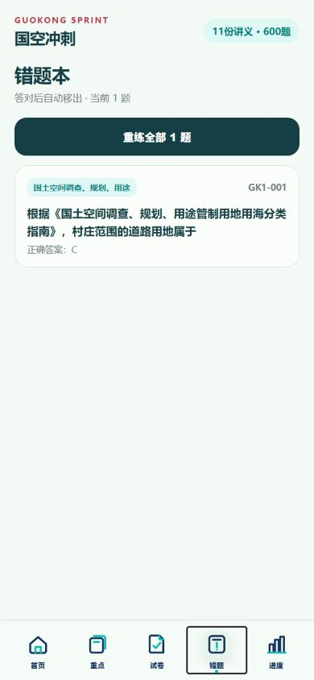
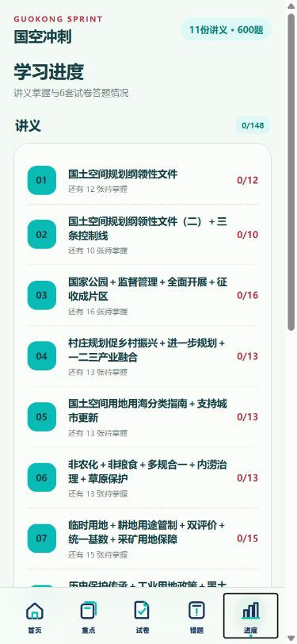

# Study Sprint Mobile

English | [简体中文](README.zh-CN.md)

Turn lectures, practice papers, and answer sheets into a source-grounded mobile study app with knowledge cards, objective quizzes, wrong-answer retry, offline progress, and a self-contained HTML file.

> [!IMPORTANT]
> **Noncommercial use only.** Personal learning and the other noncommercial purposes permitted by the license are allowed. Commercial or profit-seeking use is prohibited. See the [PolyForm Noncommercial License 1.0.0](LICENSE).

The Chinese invocation name is **抱佛脚·手机复习工具**. This repository is English-first for GitHub; the complete Chinese documentation is available above.

## Preview

These screenshots come from **Guokong Sprint**, a real Chinese-language mobile study app generated with this skill. They show the complete path from selecting materials to reviewing mistakes and tracking progress. No personal data is included.

| Home and material selection | Source-grounded knowledge cards | Practice-paper library |
| :---: | :---: | :---: |
|  |  |  |

| Question practice | Immediate answer feedback | Mistake book and retry |
| :---: | :---: | :---: |
|  |  |  |

| Learning progress |
| :---: |
|  |

## What it does

- Inventories a user-owned study-material folder and classifies lectures, papers, and answer files.
- Extracts text from supported documents and uses OCR only when needed and available.
- Builds concise knowledge cards with source locators.
- Reconstructs single-choice, multiple-choice, and true/false questions without inventing missing content.
- Provides wrong-answer retry, mastered-card tracking, and progress stored locally in the browser.
- Produces a responsive, self-contained HTML file with no external scripts, stylesheets, analytics, or required network connection.
- Requires a small sample for user approval before producing the complete dataset.

## Install

Clone or download this repository, then place the complete `study-sprint-mobile` folder in the skills directory used by your agent. You can also ask a compatible agent to install the skill directly from the GitHub repository URL.

Keep the directory structure intact: `SKILL.md`, `agents/`, `assets/`, `references/`, and `scripts/` are all part of the skill.

## Invoke

English examples:

```text
Use $study-sprint-mobile to turn this folder of lectures, practice papers, and answers into a mobile exam-review tool.
```

```text
Build a source-grounded offline study app from these course materials. Show me the sample before generating the full version.
```

Chinese examples:

```text
帮我制作抱佛脚工具，把这个资料文件夹做成手机复习网页。
```

```text
用 $study-sprint-mobile 把这些讲义、试卷和答案生成可离线使用的复习工具。
```

## Workflow

1. Confirm the source folder and inventory every file.
2. Match papers with answer files and flag ambiguous or missing pairs.
3. Extract text deterministically; mark uncertain OCR content for review.
4. Detect the material language and use it for the app interface.
5. Build and validate a sample containing at most 20 cards and 20 questions.
6. Pause for explicit user approval.
7. Build, validate, and smoke-test the complete offline HTML app.
8. Publish a hosted copy only when the user explicitly requests and authorizes it.

## Supported source formats

| Type | Formats | Notes |
| --- | --- | --- |
| PDF | `.pdf` | Text extraction uses `pypdf`; scanned pages can use optional OCR. |
| Word | `.docx` | Extracted directly from the document XML. |
| PowerPoint | `.pptx` | Extracted slide by slide from the presentation XML. |
| Images | `.png`, `.jpg`, `.jpeg`, `.tif`, `.tiff`, `.bmp`, `.webp` | Requires optional RapidOCR. |

Legacy `.doc` and `.ppt` files are identified but not modified. Convert copies to `.docx` or `.pptx` before processing.

## Runtime requirements

- Python 3.9 or newer for inventory, extraction, and language detection.
- Node.js 18 or newer for data validation, bundle generation, and smoke testing.
- `pypdf` for PDF text extraction.
- Optional: `rapidocr-onnxruntime` for image/scanned-document OCR.
- Optional: Poppler's `pdftoppm` for PDF-to-image OCR fallback.

The browser app itself has no server dependency and works offline after generation.

## Privacy and safety

- Source materials remain local unless the user separately authorizes publication.
- The bundled app contains no telemetry, analytics, remote fonts, external assets, or upload code.
- Progress is stored only in the browser's `localStorage` on the current device.
- The workflow preserves original files and does not overwrite legacy documents during conversion.
- Every card and question must retain a source file and locator; missing or ambiguous answers are surfaced for review instead of being guessed.
- Do not publish generated subject content merely because the skill itself is public. Publication requires separate authorization for that content.

Before publishing this repository, run secret, personal-path, placeholder, syntax, validation, build, and smoke-test checks.

## Repository structure

```text
study-sprint-mobile/
├── SKILL.md
├── agents/
│   └── openai.yaml
├── assets/
│   └── mobile-study-template/
├── docs/
│   └── images/
├── references/
├── scripts/
├── README.md
├── README.zh-CN.md
├── CHANGELOG.md
└── LICENSE
```

## License

Released under the [PolyForm Noncommercial License 1.0.0](LICENSE). Personal study is permitted; commercial or profit-seeking use is prohibited.
